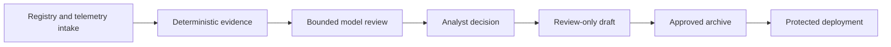

# SecOpsAI Mission Control

**An evidence-first operations console for SecOpsAI findings, research,
automation, and reviewed security publishing.**

Mission Control turns SecOpsAI Core into an operator-facing workspace. It
prioritizes the work that needs attention, explains why actions are available
or blocked, and keeps model review, local helper commands, publication, and
deployment inside explicit safety boundaries.

[Core platform](https://github.com/Techris93/secopsai) · [Documentation](https://docs.secopsai.dev) · [Website](https://secopsai.dev) · [Security research](https://blog.secopsai.dev) · [Application guide](secopsai-dashboard/README.md)

[](https://github.com/Techris93/secopsai/blob/main/docs/assets/mission-control/overview.png)

> The product tour uses representative sample data. It contains no live
> credentials, private telemetry, customer records, or local filesystem paths.

## One Console, Clear Operator Jobs

| Workspace | Purpose |
| --- | --- |
| Overview | See priorities, review queues, recent changes, and service health |
| Findings | Triage evidence-backed detections with impact, confidence, ownership, and safe next actions |
| Assets | Review the SecOpsAI Edge inventory, changes, sensors, schedules, scans, and Wi-Fi context |
| Work | Manage tasks, approvals, investigations, execution runs, and recovery |
| Research | Classify leads, operate watchlists, build durable cases, review evidence, and control sandbox or disclosure gates |
| Publications | Review sources, claims, media, approvals, the staged archive, and separate deployment state |
| Automation | Select models, configure explicit fallbacks, operate Artifact Fleet, and review durable jobs |
| System | Inspect connector health, credentials, audit context, and hosted or local capability boundaries |

Technical views such as Supply Chain Triage, Campaign Research, Blog Ops, and
SecOpsAI Intelligence live under the operator job they support rather than
appearing as competing products.

## Local Quick Start

The complete helper-backed operator mode runs from the application directory:

```bash
git clone https://github.com/Techris93/secopsai-dashboard.git
cd secopsai-dashboard/secopsai-dashboard
cp .env.example .env
```

Set `SECOPSAI_ROOT` and generate independent high-entropy values for the action
tokens in `.env`, then start the stack:

```bash
./start-local-dashboard-stack.sh
```

Open [http://127.0.0.1:45680](http://127.0.0.1:45680) and keep the terminal
open. The browser never runs arbitrary shell commands. Buttons call typed
helper routes mapped to fixed SecOpsAI argument arrays.

## Operating Modes

| Capability | Local helper | Hosted Cloudflare Pages |
| --- | --- | --- |
| Supabase-backed dashboard data | Available when configured | Available when configured |
| Core and Edge read APIs | Available | Available through server-side Worker credentials |
| Native triage and local evidence | Available | Requires an intentionally configured private helper |
| Campaign, Artifact Fleet, and exact package actions | Available | Returns safe setup guidance without a helper/Core action endpoint |
| Blog draft review | Available | Available through protected workflow dispatch |
| Blog deployment | Available only when the helper reports a ready capability | Available through the configured GitHub/Cloudflare workflow |
| Secrets | Local `.env`; never committed | Cloudflare variables and secrets; never browser configuration |

`SECOPSAI_HELPER_BASE_URL` is optional and should stay unset in hosted
production unless a live private helper is deliberately operated. The retired
`secopsai-helper.secopsai.dev` tunnel is not a default.

## Safety Model

- Operator sign-in and action authorization are separate controls.
- Hosted protected routes validate the operator session before using server-side integration credentials.
- Action tokens remain in the current browser session and are never written into URLs.
- Artifact analysis does not install packages, run lifecycle scripts, activate extensions, or execute binaries.
- Model fallback is explicit; primary-only mode never silently selects another provider.
- Sandbox submission, external disclosure, publication, and deployment remain separately approval-gated.
- Publishing stages the complete reviewed archive; deployment changes state only after delivery succeeds.

## Research To Publication



Artifact Fleet performs metadata indexing, static and YARA checks, minimized
model triage, and analyst escalation. **Source-First Artifact Research** is the
single adapter-driven workflow for npm, PyPI, crates.io, Packagist, Go, Maven,
NuGet, RubyGems, Open VSX, GitHub sources, Hugging Face metadata, containers,
and approved archives. It verifies exact metadata and checksums where
available, quarantines artifacts, never runs package code, and creates durable
Research Cases. Publications keeps editorial approval separate from deployment.

## Repository Layout

| Path | Role |
| --- | --- |
| `secopsai-dashboard/` | Canonical dashboard application, local helper, tests, and deployment guide |
| `secopsai-org/` | Agent organization and orchestration reference material |
| `.github/workflows/` | Dashboard checks and Cloudflare Pages deployment |
| `index.html`, `_worker.js` | Compatibility wrapper for repository-root Pages deployments |
| `secopsai-supabase-schema.sql` | Legacy bootstrap schema; maintained migrations live with the application |

The automated deployment intentionally uses `secopsai-dashboard/`. Keeping the
application in one directory avoids mixing runtime assets with organization
reference files while the root README remains the canonical GitHub landing
page.

## Development

```bash
cd secopsai-dashboard
npm ci --ignore-scripts
npm run check
npm test
python3 -m py_compile dashboard_server.py
python3 -m unittest tests/test_triage_ops_evidence.py -q
```

See the [application guide](secopsai-dashboard/README.md) for configuration,
local and hosted boundaries, validation, and deployment. The screenshot fixture
under `secopsai-dashboard/tests/fixtures/` contains documentation-only sample
data and is not loaded by production routes.

## License

[MIT](LICENSE)
